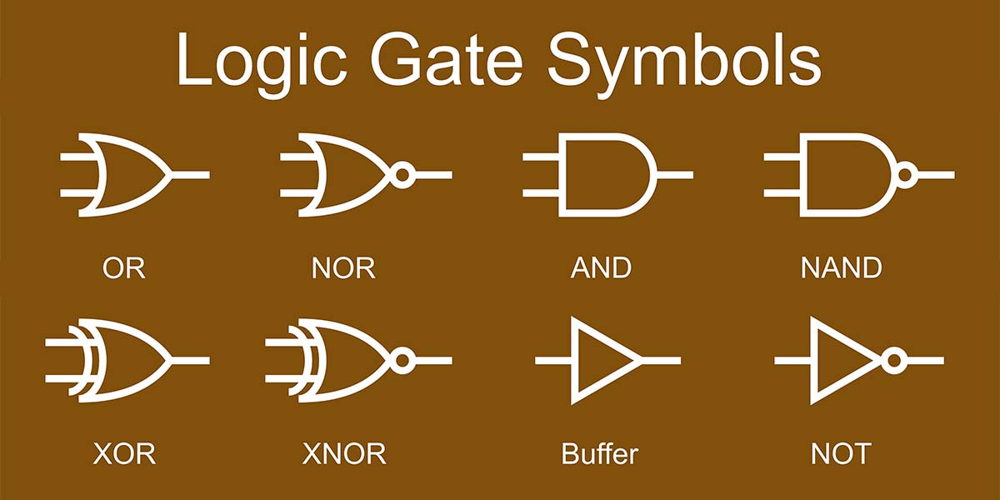

# Overview & Tasks
Since last time, you've created a chain of led that turn On and Off in a pattern.  
But today you'll dive deeper into the "highs & lows" of your Arduino Circuit.  
you'll create a simple "Computer" that can peform basic tasks  
>You will Create a Basic Logic Gate hitting the following Criterias

        - Must have a 1 Switch Logic Gate
        - Must have a 2 Switch Logic Gate
        - Cannot use Buffer or "On Off" gate
        - to indicate your Logic gate working, use the LED as an indicator
        - use the video below to Understand Logic Gates
* [Basics to Logic Gates and what they do](https://www.youtube.com/watch?v=WII9HWnf3V4&t=6s)

# Logic Gates in Layman's Terms
Your computer is made up of Transistors, little on and off switches in the computer  
within that criteria each transistors peform simple logical tasks that help determine a  
High or Low in a Current  
  
Logic Gates help peform simple tasks that can range from basic elementry math to sorting algorithms to perdetermine  
something using a LLM(Large Language Model). Logic gates are also curcial for any type of computing and learning  
Low level eletronics. Simply, most people would know some logic gates to try and do the impossible and make a simple calculator  
in a game, like "Minecraft", "Legend of Zelda", "Terraria", etc. These simple "gates" can open many pathways to  
other more complex eletronics.  

# Addational Resources
>[Logic Gate Arduino Example(You cannot Use)](https://www.youtube.com/watch?v=Z4NjJLnFNpk)
>
>
>
>

# Codeblocks
    //General

    digitalWrite(HIGH/LOW, PinNo); //To Write to the LED, using the template you replace the "PinNo" with the variables uptop, replace the High/Low with High or Low (On or Off)

    digitalRead(HIGH/LOW, PinNo); //Whatever is said up  just with reading instead of writing to it

    delay(ms); //Whenever you need to delay your code, replace ms with Millasecond of your time

    if (condition){//in C++ you have to state the Condition in a weird matter, so in our case you have to set a variable up before making a And so in the Condition you would put (digitalRead(button1) == HIGH), etc. 
        //Statement
    }
    else if (condition2){//another if under the same nested code, just if you want to put your other logic gate here it's fine, completely optional
        //Statement
    }
    else{//completely optional but we'll use it to turn the light off 
        //Statement
    }

    //Operators 

    ++ or -- //Unery Operators; add or minus to variable
    +, -, *, /, % //Arithmetic Operators - Peforming basic Math between Variable; plus, minus, multiply, divide, percent(float) the variable
    <, <=, >, >=, ==, != //Relational Operators - comparing the variable; less than, less than equal to, greater than, greater than equal to, equal, not
    &&, ||, ! //Logical Operators - Basically logic gates; And, Or, Not
    &, |, ^, <<, >>, ~, //Bitwise Operators - Takes and read every bit; and, or, xor, left, right, not

    //There are many more but for this project use these to your advantage!

# Viel Glück! 
