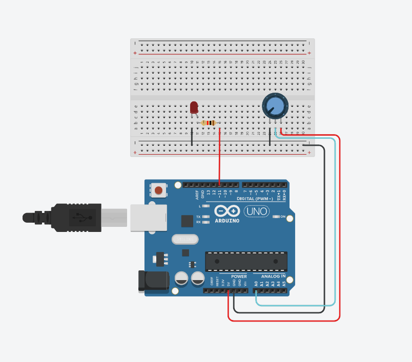
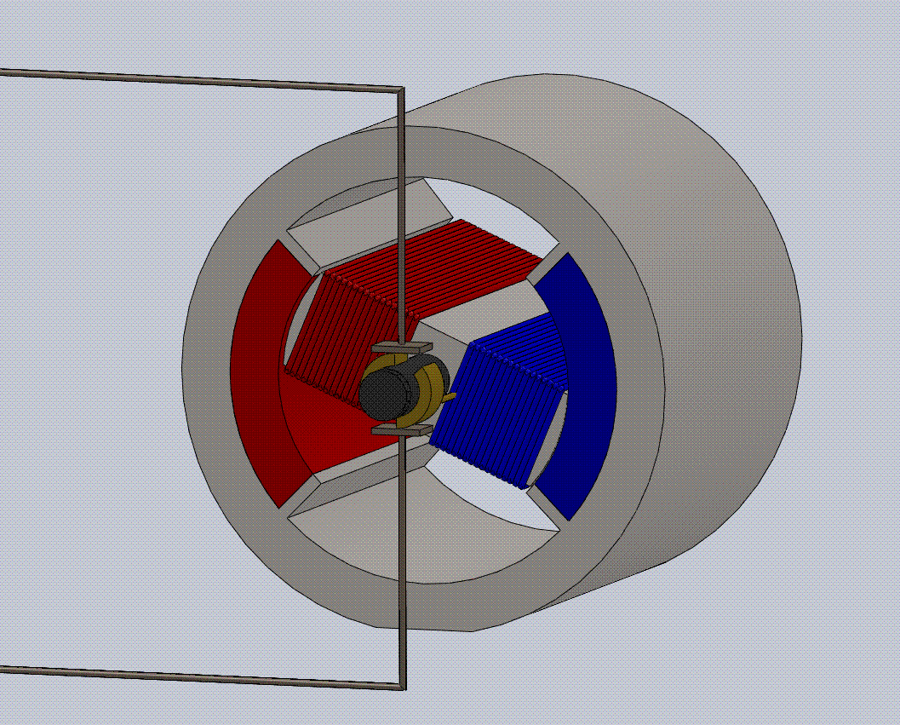
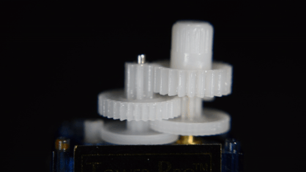

# OUTLINE  
> Day 1: PWM and LED Potentiometer  
> Day 2: Motor classes and their Main Function  
> Day 3: Motor Vibration and DC motor stuff  
> Day 4: [Project](project2files/project2.md)  

# PWM and LED Potentiometer  
Please create the circuit below:
  
This is a primary circuit that has the potential to create the primary PWM Output and Analog Input,  
Analog input and Output has a slight issue where the Microcontroller(ATMEGA) will read it as  
4 times what the PWM can output. This creates an issue if we were to feed the  
Analog Input into the PWM's write function would not work or will break the LED. So you'll
be using the / function to divide a number by 4.  
The functions you'll be using today should appear underneath.  
    analogRead(pin); //for reading the value of the analog input least is 0 most is 1025
    analogWrite(pin, brightness); //used to control the PWM least is 0 most is 255

Your source code will be provided [here](d1.ino)  

REMEMBER THIS IS NOT A HIGH-LEVEL LANGUAGE, BINDING CERTAIN INTEGER IS NECESSARY

# Motor classes  
Today you'll learn about the different motors included in your kit provided. The motors  
in your kits have:  
 * DC motor  
 * Servo motor  
 * Stepper motor

DC motor, using a magnetic field changing irreversibly, to make something spin
  

Servo motors, like DC motors, have the same moving part but some only extend to a certain amount,  
the upside of having a servo is that you can always know the degree the motor is at. Using a set of  
gears to make the gear spin faster than the power given, since there is also a potentiometer to determine  
the degree, it's a bit more thicc.  
  

Stepper motor, Unlike servo motors, can carry heavier stuff at higher speeds, The stepper motor uses a complex  
system of motors to make something spin, not exactly fast but with an impressive amount of torque.  
  

# Motor Vibration  
The motor's polarity is irreversible, you can hook a battery one way and it will spin another way, today we'll be  
exploring this by checking everything  

# PROJECT 2  
[Project2](project2files/project2.md)  
